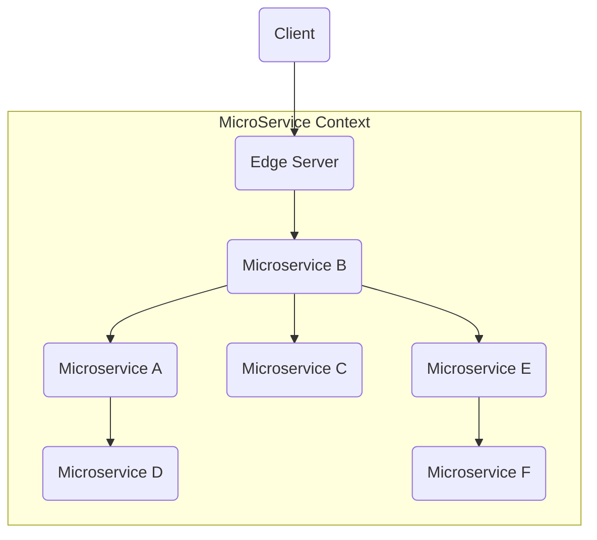
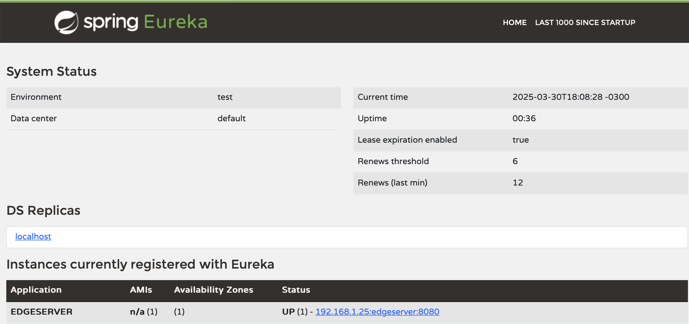

# Edge Server 

Muitas vezes nós estruturamos micro serviços que centralizem o acesso externo, protegendo serviços externos; por exemplo, um e-commerce possui uma infra-estrutura distribuiída e escalável, porém o ponto acesso às operações é único, protegendo seu variados micro-serviços que o constituem, este é o Design Pattern **Edge Server**.



> O Edge Server atua como um proxy reverso e é integrado ao **Servvice Discovery** para prover o balanceamento de carga.

# Criando o Edge Server

1. Dentro do diretorio `spring-cloud` crie um projeto Spring com a dependencias: * `Web`, `Actuator` e `Gateway`;
3. Renomeie o arquivo `main\resources\application.properties` para `application.yml`;
4. No arquivo `application.yml` inclua as configurações.

```yml
server:
  port: 8080

spring:
  application:
    name: edge-server
  cloud:
    discovery:
      client:
        locator:
          enabled: true
          lower-case-service-id: true
  eureka:
    client:
      register-with-eureka: true
      fetch-registry: true
      service-url:
        defaultZone: http://localhost:8761/eureka

```

> Acima configuramos a porta padrão do servidor e ativamos a busca e registro para com o Service Discovery

## Criando o roteamento e balanceamento de carga.

Agora que nossos microserviços estão devidamente registrados ao **Eureka Server**, vamos configurar o balanceamento de carga para nossos mricr-serviços.

### Configurando o Load Balancer

No arquivo `àpplication.yml` do **Edge Server**, inclua as configurações de roteamento, abaixo do nível cloud:

```yml
    gateway:
      routes:
        - id: product-service
          uri: lb://product-service
          predicates:
            - Path=/product/**
```

> Nesta seção, configuramos a captura das requisições ao micro serviço **product-service** para com o end-point **/product/**, assim todas as requisições para este end-point serão balanceadas para as instancias dos micro serviços  disponíveis. COmo temos 3 instancias, cada instancia receberá uma parte da carga das requisições.

O arquivo final ficará desta forma.

```yml
server:
  port: 8080

spring:
  application:
    name: edgeserver
  cloud:
    discovery:
      client:
        locator:
          enabled: true
          lower-case-service-id: true
    gateway:
      routes:
        - id: product-service
          uri: lb://product-service
          predicates:
            - Path=/product/**
  eureka:
    client:
      register-with-eureka: true
      fetch-registry: true
      service-url:
        defaultZone: http://localhost:8761/eureka
```

#### Inicie o Edge Server e confirme seu status no Eureka Service Discovery.



### Alterando o Product Service

Precisamos ajustar os ids e as portas dos micro serviços de produtos para serem roteados e balanceados.

1. Para todas instancias de **product-service**;
2. Remova o **id** e o número de porta **0** do `application.yml`, conform o exemplo abaixo:

```yml
spring:
  application:
    name: product-service

eureka:
  client:
    serviceUrl:
      defaultZone: http://localhost:8761/eureka/
    initialInstanceInfoReplicationIntervalSeconds: 5
    registryFetchIntervalSeconds: 5
  instance:
    leaseRenewalIntervalInSeconds: 5
    leaseExpirationDurationInSeconds: 5  
    # instance-id: ${spring.application.name}:${spring.application.instance_id:${random.value}}
    
# server:
  # port: 0
```

> Voce pode comentar ou remover, em outro momento iremos fixar as portas quando até entrarmos em detalhes sobre o Docker.

# Testando o balanceamento de carga

Neste ponto temos o seguinte cenário:
* Eureka ativo;
* Edge Server ativo;

Precisamos subir 3 instancias do microverviço, realizar várias requisições e validar se elas foram balanceadas para os 3 micro serviços.

## Subindo as instancias

Você precisará de 6 terminais em baerto para realizar os testes, então siga os steps abaixo atentamente.

1. Para todas os projetos;
2. Inicialize o **Service Discovery**, no primeiro terminal, a partir da raiz do `eureka-server`;
```yml
.\gradlew bootRun
```
3. Inicialize o **Edge Server**, no segundo terminal, a partir da raiz do `edgeserver`;
```yml
.\gradlew bootRun
```
4. Inicialize a **Primeira Instancia de Product Service**, no terceiro terminal, a partir da raiz do `product-service`;
```yml
.\gradlew bootRun --args='server.port=8081'
```
5. Inicialize a **Segunda Instancia de Product Service**, no quarto terminal, a partir da raiz do `product-service`;
```yml
.\gradlew bootRun --args='server.port=8082'
```
6. Inicialize a **Terceira Instancia de Product Service**, no quinto terminal, a partir da raiz do `product-service`;
```yml
.\gradlew bootRun --args='server.port=8083'
```

## Validando o balanceamento

No sexto terminal, iremos disparar as requisições; então será necessário um pouco de destreza para enviar pelo menos umas 20 requisições o mais rápido que puder e verificar o **IP** retornado por cada uma das instancias.

### Resultado esperado

Como resultado, é esperado que enviemos todas as requisições para a url `http://localhost:8080/product/1` e que as 3 instancias retornem o processamento das requisições, você poderá conferir pelo número da porta que a requisição retornou.

```shell
product-service git:(initial) ✗ curl "http://localhost:8080/product/1"
{"id":1,"name":"iPad Pro M4","weight":500,"serviceAddress":"Esdras-MacBook-Pro-M2.local/127.0.0.1:8081"}

product-service git:(initial) ✗ curl "http://localhost:8080/product/2"
{"id":1,"name":"iPad Pro M4","weight":500,"serviceAddress":"Esdras-MacBook-Pro-M2.local/127.0.0.1:8082"}

product-service git:(initial) ✗ curl "http://localhost:8080/product/1"
{"id":1,"name":"iPad Pro M4","weight":500,"serviceAddress":"Esdras-MacBook-Pro-M2.local/127.0.0.1:8083"}

product-service git:(initial) ✗ curl "http://localhost:8080/product/1"
{"id":1,"name":"iPad Pro M4","weight":500,"serviceAddress":"Esdras-MacBook-Pro-M2.local/127.0.0.1:8082"}

product-service git:(initial) ✗ curl "http://localhost:8080/product/1"
{"id":1,"name":"iPad Pro M4","weight":500,"serviceAddress":"Esdras-MacBook-Pro-M2.local/127.0.0.1:8081"}
```

> Troque o id do produto e tente enviar uma alta carga de requisições e ficará explicito o balanceamento.

# Terminamos!

## Nossos próximos patterns serão Central Configuration, Centralized Log Analysis.