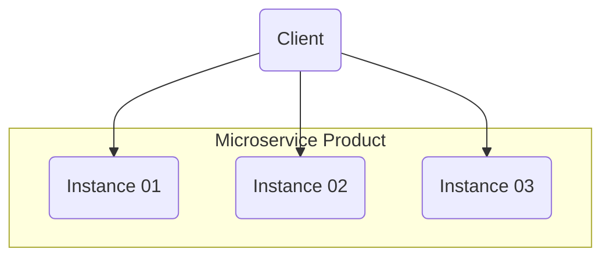
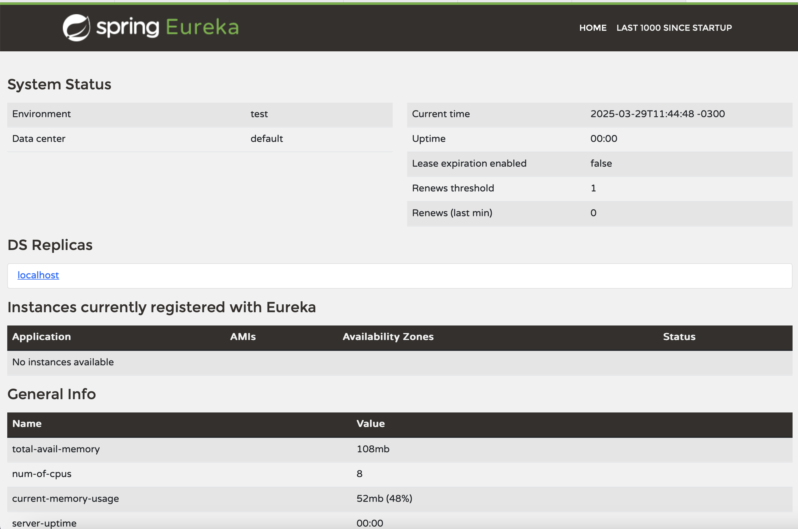
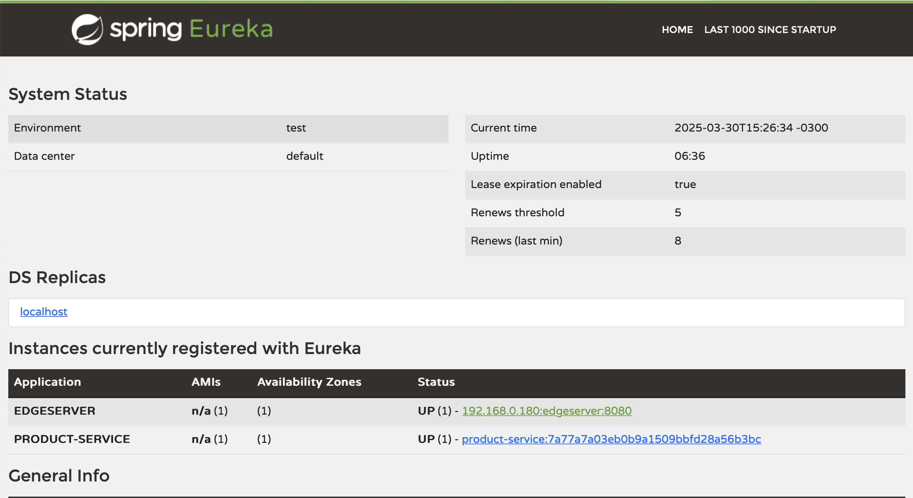
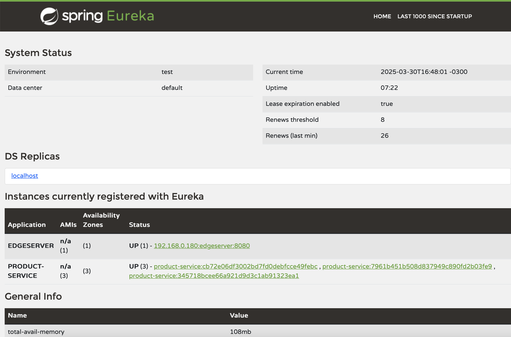

# Service Discovery

O Service Discovery é um padrão de design utilizado em arquiteturas de microsserviços para permitir que os serviços se encontrem dinamicamente sem depender de configurações fixas de endereço IP ou host. Ele facilita a escalabilidade, a resiliência e a flexibilidade da comunicação entre serviços.

## Como funciona?

Em um sistema distribuído, os microsserviços podem escalar dinamicamente e mudar de localização (endereço IP/porta).

O Service Discovery resolve isso permitindo que os serviços se registrem em um Registry (Registro de Serviços), onde outros serviços podem consultá-los para encontrar a instância correta com base no nome do serviço.



### Existem dois tipos principais de Service Discovery:

#### Client-side (Descoberta no Cliente)

O cliente consulta o Service Registry diretamente para obter o endereço do serviço antes de enviar a requisição.

#### Server-side (Descoberta no Servidor)

O cliente chama um Load Balancer que consulta o Service Registry e redireciona a requisição para uma instância do serviço.

## Spring Boot e Eureka (Netflix Eureka)

O **Eureka Server** é um serviço de descoberta (Service Discovery) da Netflix OSS, amplamente utilizado em arquiteturas de microsserviços com Spring Cloud. 
Ele permite que serviços se registrem dinamicamente e descubram uns aos outros sem necessidade de configuração manual.

### Como Funciona?
#### Registro
Os microsserviços clientes (Eureka Clients) se registram no Eureka Server.

#### Descoberta
Quando um serviço precisa chamar outro, ele consulta o Eureka Server para obter a localização do serviço desejado.

#### Heartbeats
Os clientes enviam sinais periódicos (heartbeats) para indicar que estão ativos.

#### Remoção Automática
Se um cliente parar de responder, o Eureka Server o remove da lista.

## Criando um Service Discovery

1. No diretório raiz `microservices`, crie o diretorio `spring-cloud`;
2. Dentro do diretorio `spring-cloud` crie um projeto Spring com a dependencias: * `Web`, `Actuator` e `Netflix Eureka Server`;
3. Renomeie o arquivo `main\resources\application.properties` para `application.yml`;
4. No arquivo `application.yml` inclua as configurações.

```yml
spring:
  application:
    name: eureka-server

server:
  port: 8761

eureka:
  client:
    fetch-registry: false
    register-with-eureka: false
```

> Acima configuramos a porta padrão do servidor e desmarcamos a busca e registro par o próprio servidor na rede, afinal ele não pode se auto-registrar em si mesmo...

5. Na classe Principal, inclua a anotação `@EnableEurekaServer` para habilitar o Discorey.

```java
import org.springframework.boot.SpringApplication;
import org.springframework.boot.autoconfigure.SpringBootApplication;
import org.springframework.cloud.netflix.eureka.server.EnableEurekaServer;

@EnableEurekaServer
@SpringBootApplication
public class EurekaServerApplication {

	public static void main(String[] args) {
		SpringApplication.run(EurekaServerApplication.class, args);
	}

}
```

6. Inicie o projeto.

```shell
.\gradlew bootRun
```

7. Acesse a interface do servidor.

```
http://localhost:8761
```



> Observe que o servidor está on-line mas precisamos registrar as instancias de microserviços nele.

# Regitrando os Micro Serviços no Servide Discovery

Precisamos fazer com que os micro-services de nosso ecossistema se registrem ao `Discovery Service` para que ao escalar novas instancias, elas sejam localizadas num ponto central, assim o balanceamento de carga que logo iremos implementar fará com que as instancias do mesmo micro-service ao se registrarem possam receber uma parte da carga de processamento.

## Alterando as configurações do product-service

Inclua no `application.yml` de **product-service**,  as configurações abaixo:

```ymal
spring:
  application:
    name: product-service

eureka:
  client:
    serviceUrl:
      defaultZone: http://localhost:8761/eureka/
    initialInstanceInfoReplicationIntervalSeconds: 5
    registryFetchIntervalSeconds: 5
  instance:
    leaseRenewalIntervalInSeconds: 5
    leaseExpirationDurationInSeconds: 5
    instance-id: ${spring.application.name}:${spring.application.instance_id:${random.value}}

server:
  port: 0
```

> Nas configurações acima, configuramos o zona padrão para busca de um Service Discovery para registro do micro-service; o tem de busca e renovação de registro e um id personalidado para cada instancia. Com estas configurações o micro-service se registrará no Service Discovery.

### Validando o registro do product-service ao Service Discovery

1. Inicialize o **product-service**;
2. Acesse a página do **Service Discovery** (Eureka) e valide o registro do micro-service.



### Escalando as instancias de product-service

Crie mais 2 instancias do **product-service** com o comando abaixo, a partir da raiz do projeto.

1. Abra um terminal e execute.
```shell
.\gradlew bootRun
```

2. Abra um tsegundo erminal e execute.
```shell
.\gradlew bootRun
```

### Valide as instancias as 3 registradas



# Edge Server

Agora iremos inicar a construção de um [Edge Server](edge-server.md).


