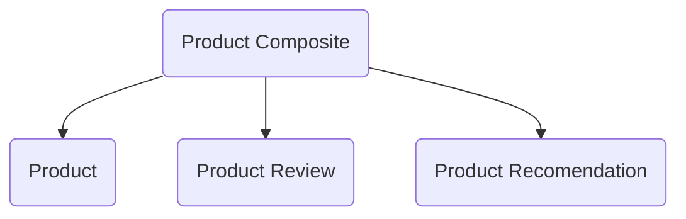

# Micro Services

Neste projeto iremo criar microservices, trbalhando com a comunicação síncrona e assíncrona.

Iremos criar APIs, transformá-las em microservices e adequá-las para a comunicação sincrona com a comunicacao direta e posteriormente com a comunicacao assincrona com o uso de message brokers.

# Product Composite Project

Iremos criar um servico de produtos que irá gerenciar informacoes sobre produtos, as informacoes providas serao:
* Dados de produto;
* Review de Produtos;
* Recomendacoes de Produto;

Teremos 3 microservies independentes e um microservice orquestrador que irá conectar os outro 3 microservices.

# Product Service

O Product MicroService irá gerencias as inforacoes e a descricao de cada produto com base nos atributos abaixo:

* Id;
* Name;
* Weight;

Incialmente iremos criar este microservice com um recurso (end-point) de exemplo e a seguir iremos criar multiplas instancias e conecta-las à um `Service Discovery`.

## Criar o Product Service

Acesse as instruções para criar o [Product Service](docs/product-service.md).

