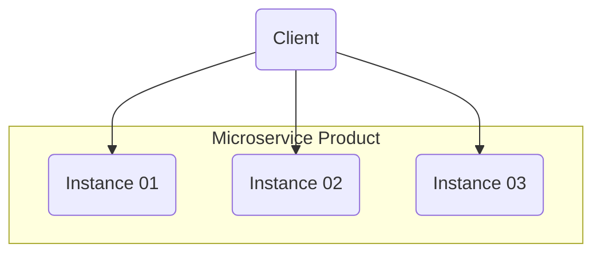

# Service Discovery

O Service Discovery é um padrão de design utilizado em arquiteturas de microsserviços para permitir que os serviços se encontrem dinamicamente sem depender de configurações fixas de endereço IP ou host. Ele facilita a escalabilidade, a resiliência e a flexibilidade da comunicação entre serviços.

## Como funciona?

Em um sistema distribuído, os microsserviços podem escalar dinamicamente e mudar de localização (endereço IP/porta).

O Service Discovery resolve isso permitindo que os serviços se registrem em um Registry (Registro de Serviços), onde outros serviços podem consultá-los para encontrar a instância correta com base no nome do serviço.

### Existem dois tipos principais de Service Discovery:

#### Client-side (Descoberta no Cliente)

O cliente consulta o Service Registry diretamente para obter o endereço do serviço antes de enviar a requisição.

#### Server-side (Descoberta no Servidor)

O cliente chama um Load Balancer que consulta o Service Registry e redireciona a requisição para uma instância do serviço.

## Spring Boot e Eureka (Netflix Eureka)

### To be continue...

